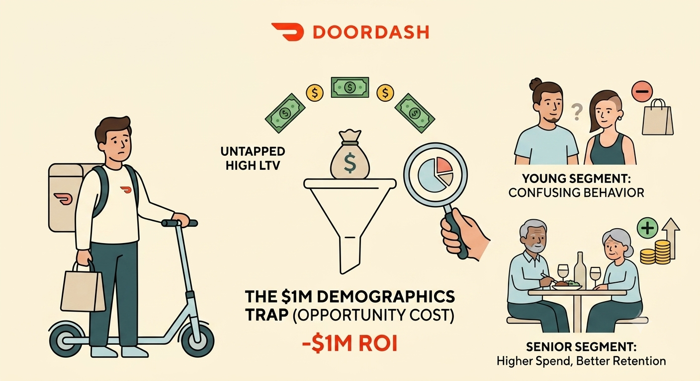
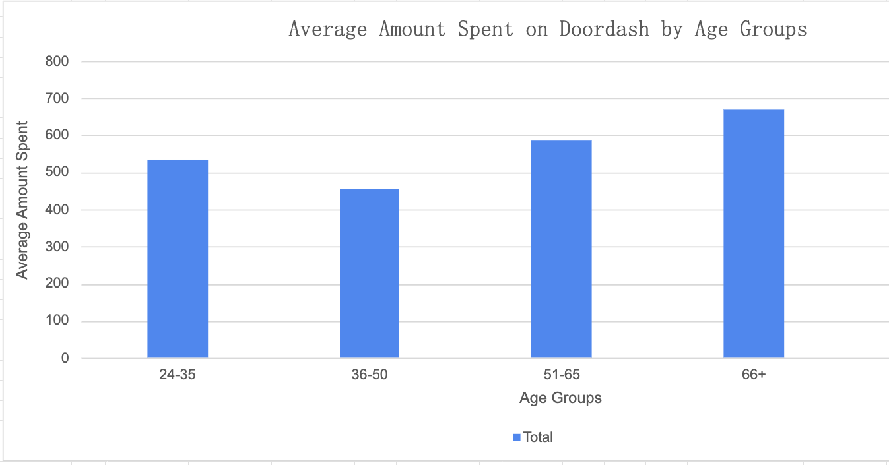
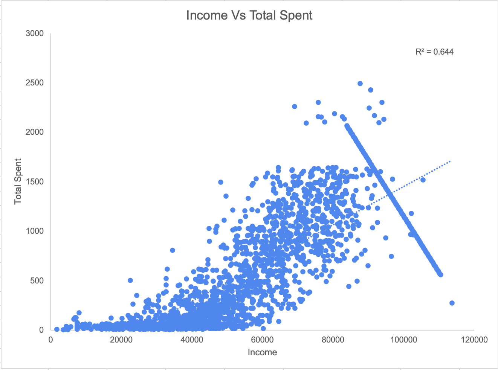
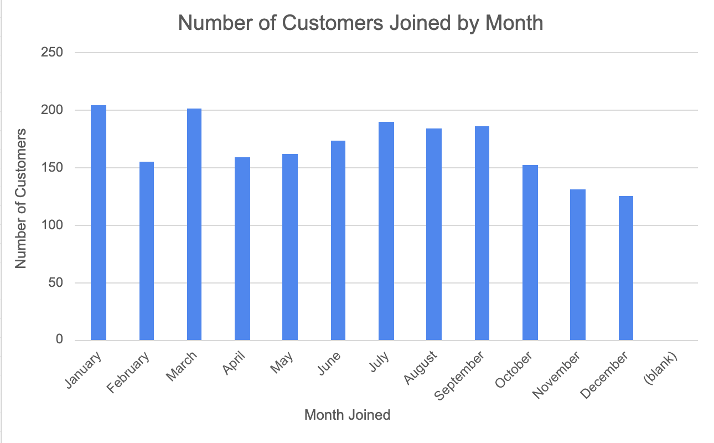

# The $1M Demographics Trap: How Misreading Customer Age Is Costing Delivery Platforms Millions

Many delivery platforms assume that their largest customer groups are also their most valuable. But when you look closer, the numbers often tell a different story. This analysis set out to answer a key question: does a customer’s age really predict how much they spend, and are platforms missing out by not tailoring their marketing to the right age groups?
 
 

## Why I Picked This Project 🔍

My inspiration for this project came from my own experience as a DoorDash driver. I noticed patterns in who ordered most often and who placed the biggest orders, but I wanted to back up those hunches with actual data. For platforms like DoorDash, knowing which age groups drive the most revenue could help marketing teams spend their budgets smarter and boost their ROI.
 
 

## The Data and Tools I Used 📊

I used a marketing analytics dataset from Kaggle, which included 2,021 customers and 45 different features. These features covered demographic details (like age, income, and marital status), spending data (such as total spend and category-specific purchases), customer engagement (like account tenure and order frequency), and marketing campaign responses. All of my analysis was done in Excel.
 
 

## What I Found 💡

The results revealed some surprising differences in how different age groups contribute to the platform’s revenue:
 
 

### Volume vs. Value Isn’t What You Expect 

The 36–50 age group had the highest number of customers (855), but they spent the least on average—about $453 per person. Meanwhile, the 66+ age group was much smaller (285 customers), yet their average spend was the highest at $670 per person.

### Who Drives the Platform’s Revenue?

The 51–65 group turned out to be the main engine for revenue, contributing about $400,646—roughly 37% of total platform spend. This is because they combined a fairly large customer count with strong average spending.

 

### Income Matters More Than Age Alone 

When I looked at correlations, age had only a slight connection to higher spending. Income, on the other hand, had a much stronger link. Older customers tend to spend more, but it’s because they have higher average incomes.

 

### When Do Customers Join?

Signups peaked in January and March, then dropped off in December. This points to a clear seasonal trend in customer acquisition, which could help marketing teams decide when to push for new signups versus focusing on retention.

 

 
### The “Sandwich Generation” Surprised Me

The biggest surprise was the underperformance of the 36–50 group. Despite being in their prime working years and heavily using digital apps, they spent less than every other age group. One possible reason is that this group is often supporting both children and older family members, which may limit their discretionary spending.
 
 

## Why This Matters 🌟

The main lesson here is that the largest customer group isn’t always the most valuable. If marketing teams focus only on volume, they risk missing out on segments with much higher spending power. For DoorDash, this could mean shifting marketing strategies to reward the high-spending 51–65 group with loyalty perks, while designing targeted campaigns to boost spending among the 36–50 group.
 
 

## Reflection & Conclusion 📝

This analysis highlights that customer spending on delivery platforms varies meaningfully by age group. Most customers spend less than $500, but older age segments—especially those over 51—tend to spend more per person and contribute significantly to total revenue. Patterns in sign-up timing and campaign engagement also differ by age. While these findings don’t prove that age alone drives spending, they do suggest that understanding customer demographics can help businesses make more informed decisions about where to focus their efforts. By moving beyond assumptions and looking carefully at the data, it’s possible to see where marketing and customer engagement strategies might have the most impact.
 
 

